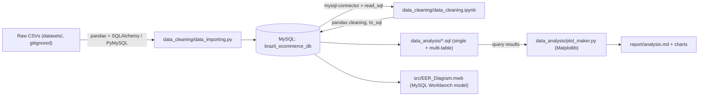
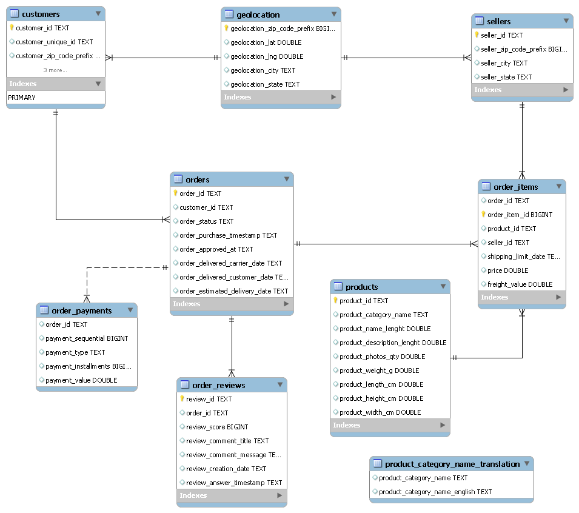
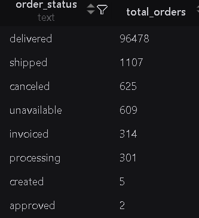
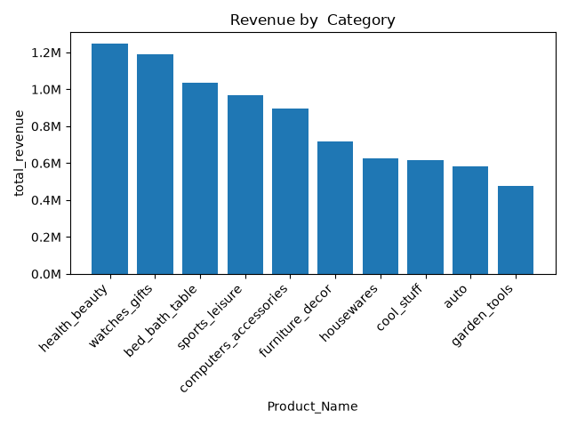
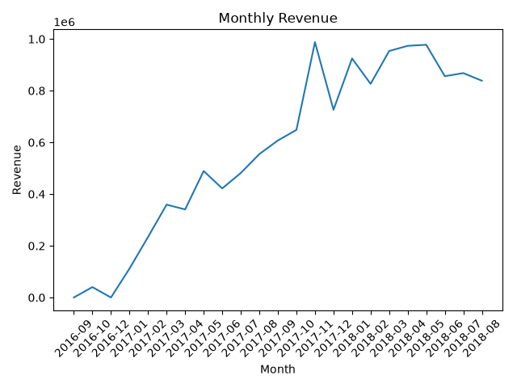
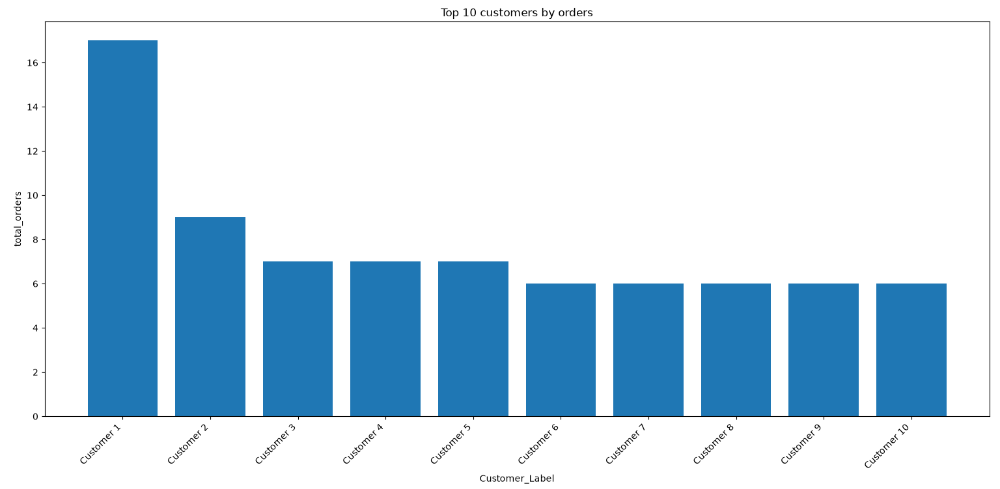
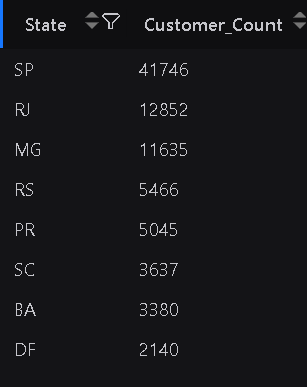
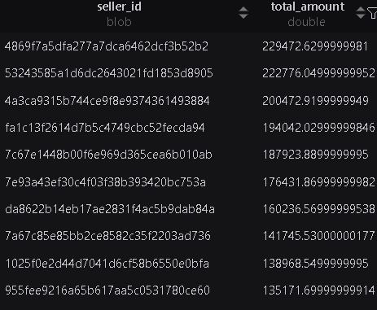
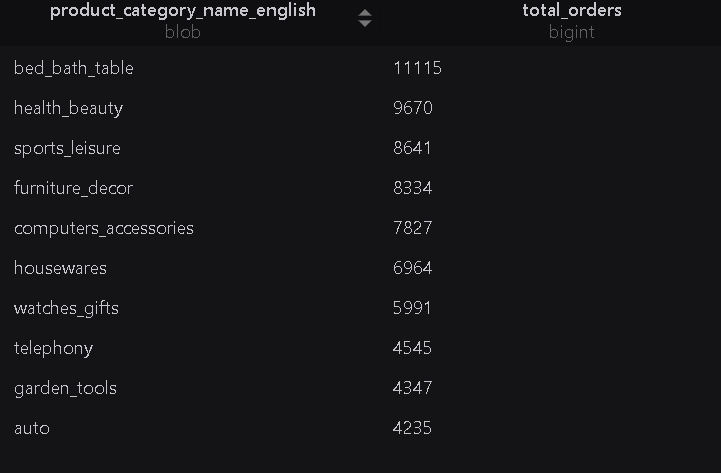
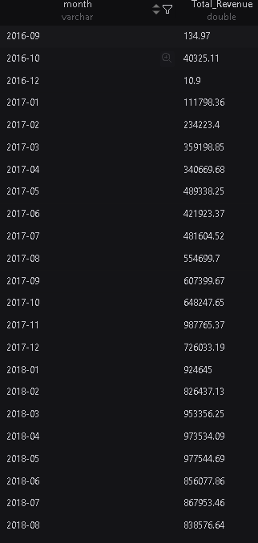

# Brazil E-commerce Analytics (Olist)

A SQL-first analytics project that turns the public Olist Brazilian marketplace data into a normalized MySQL database and answers business questions about customers, sellers, products, and revenue.

**Pipeline:** raw CSVs → Python ingestion → Pandas data cleaning → MySQL `brazil_ecommerce_db` → SQL business analysis → Matplotlib charts → Markdown report.

---

## Overview

Marketplace data rarely arrives analysis-ready: it is spread across denormalized CSV exports, contains missing values and duplicated reference rows, and mixes Portuguese and English category labels. This project builds a local MySQL analytical store over that data and queries it the way an analyst would in production — with joins and aggregations in SQL rather than a single notebook.

The work covers three deliverables:

1. **A load-and-clean pipeline** that stages the raw files into MySQL, profiles nulls and duplicates, applies explicit imputation rules, and writes clean tables back to the database.
2. **A documented star-like schema** with an EER diagram and verified one-to-many relationships between orders, customers, items, payments, reviews, products, sellers, and geolocation.
3. **A set of business analyses** — top customers, top sellers by revenue, best-selling categories, revenue by category, and monthly revenue — captured as reusable SQL and published with charts in `report/analysis.md`.

This is an analytics and data-engineering project. It contains no machine learning models, no API service, and no deployed frontend.

## Key Features

- **Automated multi-table ingestion** — loops the `datasets/` folder and derives table names from filenames (`olist_customers_dataset.csv` → `customers`).
- **Reproducible data profiling** — per-table null and duplicate counts captured before and after cleaning, with stored notebook outputs.
- **Explicit imputation strategy** — median imputation for product physical attributes, sentinel labels (`UnKnown_Product`, `UnAvailable`) for categorical and free-text gaps, and `NaT` preserved for status-dependent order timestamps instead of being fabricated.
- **Referential integrity documentation** — EER model plus a written 1:N relationship map for all eight joins used in the analysis.
- **Multi-table SQL analysis** — 8-table joins across `orders`, `order_items`, `order_payments`, `products`, and `product_category_name_translation` for customer, seller, category, and time-series revenue questions.
- **Chart generation from live query results** — `plot_maker.py` executes SQL through `pandas.read_sql` and renders Matplotlib figures directly from the database.
- **Bilingual category support** — Portuguese-to-English category translation applied in SQL so results are reportable in both languages.

## System Architecture



All components run locally against a local MySQL 8 instance on port 3306. There is no server, container, or cloud deployment.

## Technical Approach

### 1. Ingestion

`data_importing.py` connects to the MySQL *server* (no database selected), issues `CREATE DATABASE IF NOT EXISTS brazil_ecommerce_db`, then reads every CSV in `datasets/` with `pd.read_csv` and loads it via `df.to_sql(..., if_exists="replace")`. It finishes by printing the first five rows and `DESCRIBE` output for each table to confirm the load.

Because the source files are untyped, SQLAlchemy infers column types on load — which is why the EER diagram initially shows `TEXT`/`DOUBLE` columns and why `multi_table_analysis.sql` contains an `ALTER TABLE ... MODIFY COLUMN` block converting the five `orders` timestamp columns to `DATETIME NULL` before date arithmetic and `DATE_FORMAT` can be used.

### 2. Cleaning

`data_cleaning.ipynb` reads every table back out of MySQL into `df_<table>` DataFrames, profiles them, applies fixes, and writes the cleaned frames back.

| Issue | Detection | Rule applied |
|---|---|---|
| Missing product category (610 rows) | `isnull().sum()` | Filled with `"UnKnown_Product"` |
| Missing product name/description length, weight, dimensions (610 / 2 rows) | `isnull().sum()` | Column-wise **median** imputation |
| Missing `product_photos_qty` (610 rows) | `isnull().sum()` | Filled with `0` |
| Missing review title (87,656) and message (58,247) | `isnull().sum()` | Filled with `"UnAvailable"` |
| Missing order timestamps (`order_approved_at` 160, carrier 1,783, customer 2,965) | `isnull().sum()` + `order_status` grouping | Parsed with `pd.to_datetime(errors="coerce")` and left as `NaT` — absences are genuine (cancellations, unfulfilled orders), so they are not imputed |
| Duplicate geolocation rows (261,831) | `duplicated().sum()` | `drop_duplicates()`, reducing 1,000,163 → 738,332 rows |

Nulls and duplicates were re-profiled after cleaning to confirm only the intentionally preserved `NaT` timestamp gaps remain.

### 3. Analysis

Single-table SQL in `data_analysis/` profiles each entity (customer and seller geographic concentration, distinct states/cities, order-status distribution, unique product categories). `multi_table_analysis.sql` then answers the cross-entity questions through joins, with revenue defined as `SUM(order_items.price)` and restricted to meaningful order states (`delivered`, `shipped`) for category revenue and `delivered` for monthly revenue.

### 4. Visualization

`plot_maker.py` runs a Top-10 customers-by-orders query through `pandas.read_sql` and renders a Matplotlib bar chart. Other report figures were produced from query results with Matplotlib/Seaborn in the notebook workflow and stored in `report/`.

## Data Model

Nine tables, related by `customer_id`, `order_id`, `product_id`, `seller_id`, and `product_category_name`.



| Relationship | Type | Basis |
|---|---|---|
| `customers` → `orders` | 1:N | `customer_id` |
| `orders` → `order_items` | 1:N | `order_id` (an order holds multiple items) |
| `orders` → `order_payments` | 1:N | `order_id` (split payments) |
| `orders` → `order_reviews` | 1:N | `order_id` |
| `sellers` → `order_items` | 1:N | `seller_id` |
| `products` → `order_items` | 1:N | `product_id` |
| `products` → `product_category_name_translation` | N:1 | `product_category_name` |
| `geolocation` | reference | joined by `*_zip_code_prefix` |

Full narrative: `report/analysis.md`.

## Dataset

Public **Olist Brazilian E-Commerce Dataset** (Brazilian marketplace orders, 2016-09 → 2018-10). The CSVs live in `datasets/`, which is **gitignored** — they must be obtained separately and are not redistributed from this repository.

| Table (in MySQL) | Rows loaded | Notes |
|---|---|---|
| `customers` | 99,441 | 96,096 unique customers, 27 states, 4,119 cities |
| `orders` | 99,441 | 8 columns; 96,478 `delivered` |
| `order_items` | 112,650 | Line-level `price` and `freight_value` |
| `order_payments` | 103,886 | More rows than orders → split payments |
| `order_reviews` | 99,224 | `review_score` 1-5 plus free text |
| `products` | 32,951 | Category, dimensions, weight, photo count |
| `sellers` | 3,095 | Seller location metadata |
| `geolocation` | 738,332 | Deduplicated from 1,000,163 raw rows |
| `product_category_name_translation` | 71 | PT → EN category labels |

Key fields used in analysis: `customer_unique_id`, `order_status`, `order_purchase_timestamp`, `price`, `payment_value`, `product_category_name`, `seller_id`, and the `*_zip_code_prefix` join keys.

## Results

All figures below are computed from the cleaned tables in MySQL and reproduced in `report/analysis.md`.

**Order fulfillment** — 96,478 of 99,441 orders (97.0%) reached `delivered`. The remainder is distributed across `shipped` (1,107), `canceled` (625), `unavailable` (609), `invoiced` (314), `processing` (301), `created` (5), and `approved` (2).



**Revenue by category** — top categories by `SUM(price)` over delivered and shipped orders:

| Rank | Category | Revenue (R$) |
|---|---|---|
| 1 | health_beauty | ~1,246,000 |
| 2 | watches_gifts | ~1,189,000 |
| 3 | bed_bath_table | ~1,034,000 |
| 4 | sports_leisure | ~966,000 |
| 5 | computers_accessories | ~897,000 |



**Monthly revenue** — delivered-order revenue climbs from late 2016, peaks at **R$987,765 in November 2017**, and stays near R$0.85-1.0M through mid-2018 before tapering as the dataset's final months contain fewer completed deliveries.



**Customer concentration** — demand is dominated by southeastern states (SP 41,746 customers, followed by RJ and MG), and the top customers by order count are captured in the chart below; the same cohort is analysed by total payment value and by items purchased.



**Category coverage** — 74 distinct product categories exist in the cleaned `products` table (73 in the raw file plus the `UnKnown_Product` imputation label).

There is no model evaluation section because no predictive model is built; validation here is data-quality validation (null/duplicate profiling before and after cleaning) and cross-checking query output against the underlying CSVs.

## Tech Stack

| Layer | Technology |
|---|---|
| Language | Python 3.10, SQL (MySQL dialect) |
| Data handling | pandas, NumPy |
| Database | MySQL 8 (`brazil_ecommerce_db`), MySQL Workbench for modelling |
| Connectivity | SQLAlchemy 2.0 + PyMySQL (ingestion/write-back), `mysql-connector-python` (notebook/plot reads) |
| Analysis | SQL joins, aggregations, window-free date bucketing (`DATE_FORMAT`) |
| Visualization | Matplotlib, Seaborn |
| Environment | `python-dotenv`, virtual environment, Jupyter |
| Reporting | Markdown + PNG charts |

Versions verified in the project's `.venv`: pandas 3.0.3, SQLAlchemy 2.0.51, PyMySQL 1.2.0, mysql-connector-python 9.7.0, matplotlib 3.11.1, seaborn 0.13.2, numpy 2.5.1, python-dotenv 1.2.2, jupyterlab 4.6.1.

## Project Structure

```text
brazil-ecommerce/
├── data_cleaning/
│   ├── data_importing.py       # create DB, load raw CSVs into MySQL
│   └── data_cleaning.ipynb     # profile, clean, write back to MySQL
├── data_analysis/
│   ├── customer_query.sql      # customer geography and cardinality
│   ├── orders_query.sql        # order counts and status distribution
│   ├── products_query.sql      # unique product categories
│   ├── seller_query.sql        # seller city distribution
│   ├── geolocation_query.sql   # postal-code coverage by city/state
│   ├── multi_table_analysis.sql# schema fix + all business questions
│   └── plot_maker.py           # SQL → DataFrame → Matplotlib chart
├── datasets/                   # raw Olist CSVs (gitignored)
├── report/
│   ├── analysis.md             # relationship map + per-table and multi-table findings
│   └── *.png                   # charts referenced by analysis.md
├── src/
│   ├── EER_Diagram.mwb         # MySQL Workbench model
│   └── EER_diagram.png         # exported EER diagram
└── .env                        # DB credentials (gitignored)
```

## Installation & Setup

### Prerequisites

- MySQL 8 running locally (default port 3306) with a user that can create databases
- Python 3.10+
- A copy of the Olist dataset CSVs (see [Dataset](#dataset))

### 1. Clone and create the environment

```bash
git clone https://github.com/Muhammed-Shameel/brazil_ecommerce-data_analysis.git
cd brazil_ecommerce-data_analysis
python -m venv .venv
.venv\Scripts\activate          # Windows
source .venv/bin/activate       # macOS/Linux
```

### 2. Install dependencies

No `requirements.txt` is committed yet; install the packages the scripts import:

```bash
pip install pandas numpy matplotlib seaborn "SQLAlchemy>=2.0" PyMySQL mysql-connector-python python-dotenv jupyter
```

### 3. Configure credentials

Create a `.env` file in the repository root (no `.env.example` is committed yet):

```dotenv
DB_HOST=127.0.0.1
DB_PORT=3306
DB_USER=your_mysql_user
DB_PASSWORD=your_mysql_password
```

| Variable | Purpose | Used by |
|---|---|---|
| `DB_HOST` | MySQL host, e.g. `127.0.0.1` | all three entry points |
| `DB_PORT` | Reserved; the scripts currently hard-code port `3306` in `URL.create` | — |
| `DB_USER` | MySQL username | all three entry points |
| `DB_PASSWORD` | MySQL password | all three entry points |

The database name is fixed in code as `brazil_ecommerce_db`. Never commit `.env` (already gitignored).

### 4. Place the datasets

Copy the nine Olist CSV files into `datasets/`. Update the `folder` path in `data_cleaning/data_importing.py` to your own absolute path — it is currently hard-coded to the original author's machine.

### 5. Load, then clean

```bash
python data_cleaning/data_importing.py
```

Then open `data_cleaning/data_cleaning.ipynb` and run all cells to clean and write the tables back.

> **Before re-running the notebook:** its `to_sql(..., if_exists="append")` calls are not idempotent. Drop or truncate the target tables first, otherwise a second run duplicates every row. See [Limitations](#limitations).

### 6. Query

```bash
mysql -u "$DB_USER" -p brazil_ecommerce_db < data_analysis/multi_table_analysis.sql
```

or open the `.sql` files in MySQL Workbench / VS Code (SQLTools) and run them interactively.

## Usage

| Task | Where | How |
|---|---|---|
| Load raw data | `data_cleaning/data_importing.py` | Run as a script (needs `.env`) |
| Clean and reload | `data_cleaning/data_cleaning.ipynb` | Run all cells in order |
| Answer a business question | `data_analysis/multi_table_analysis.sql` | Execute the relevant statement |
| Profile one entity | `data_analysis/<entity>_query.sql` | Execute in a MySQL client |
| Produce a chart | `data_analysis/plot_maker.py` | Edit `query`, then run the script |
| Read the findings | `report/analysis.md` | Open directly on GitHub |

Example — revenue by category across four tables:

```sql
SELECT
    pt.product_category_name_english AS Product_Name,
    ROUND(SUM(i.price), 2) AS total_revenue
FROM products p
JOIN product_category_name_translation pt
    ON p.product_category_name = pt.product_category_name
JOIN order_items i ON p.product_id = i.product_id
JOIN orders o      ON i.order_id = o.order_id
WHERE o.order_status IN ("delivered", "shipped")
GROUP BY Product_Name
ORDER BY total_revenue DESC
LIMIT 20;
```

Example — monthly revenue from delivered orders:

```sql
SELECT
    DATE_FORMAT(o.order_purchase_timestamp, '%Y-%m') AS month,
    ROUND(SUM(i.price), 2) AS Total_Revenue
FROM order_items i
JOIN orders o ON i.order_id = o.order_id
WHERE order_status = "delivered"
GROUP BY month
ORDER BY month;
```

## Screenshots

| Customer distribution by state | Top sellers by revenue |
|---|---|
|  |  |

| Best-selling categories (EN) | Monthly revenue query result |
|---|---|
|  |  |

## Limitations

- **Datasets are not version-controlled.** `datasets/` is gitignored, so a fresh clone cannot reproduce results without manually obtaining the Olist files.
- **Hard-coded local paths and database name.** `data_importing.py` points at an absolute Windows path, and `brazil_ecommerce_db` is fixed in three files; there is no CLI argument or config layer.
- **Two scripts need edits before they run.** `data_importing.py` calls `load_dotenv()` without importing it, and `plot_maker.py` reads a `Customer_Label` column whose generating line is commented out. Both are usable as written templates but not as-is executables.
- **Non-idempotent write-back.** The notebook appends cleaned frames with `if_exists="append"`; re-running it without dropping tables duplicates data.
- **No enforced constraints.** Primary and foreign keys are documented in the EER model but not applied in the database, and no indexing strategy exists beyond what the loader infers. Column types start as `TEXT` and are corrected manually via `ALTER TABLE`.
- **Revenue definition is deliberately narrow.** `SUM(order_items.price)` excludes `freight_value` and payment-side amounts, and category/monthly figures filter on order status, so they are not comparable to `order_payments.payment_value` totals.
- **Analysis is descriptive, not predictive.** No cohort, retention, delivery-delay, or forecasting work exists yet; findings stop at aggregation and ranking.
- **Manual chart pipeline.** Only one chart is generated by committed code; the rest of `report/` was produced interactively and is not reproducible from a single command.
- **Local-only execution.** No containerization, CI, tests, or deployment.

## Future Work

- Add `requirements.txt` and a `Makefile`/CLI to make load → clean → analyse reproducible in one command.
- Parameterize paths and credentials (including `DB_PORT`) via `.env`.
- Apply primary keys, foreign keys, and indexes in DDL so the physical schema matches the EER model.
- Make the cleaning step idempotent (`replace` on a staging schema, or explicit `TRUNCATE`).
- Extend the analysis with the questions not yet implemented: **average delivery time** (`order_delivered_customer_date` − `order_purchase_timestamp`), **delivered vs. estimated delay**, and **repeat-customer rate**.
- Add review-score analysis to link satisfaction with delivery performance and category.
- Store the cleaned data as Parquet alongside MySQL for faster notebook iteration.

## Acknowledgements

- Dataset: **Olist Brazil E-Commerce Public Dataset**, released by Olist on Kaggle for open analysis.
- Diagrams and charts in `report/` were generated from this project's own queries.

## License

No license file is present in this repository. The project code is therefore unlicensed by default; the Olist dataset remains subject to its own upstream terms. Add a `LICENSE` file before reusing or redistributing this code.
