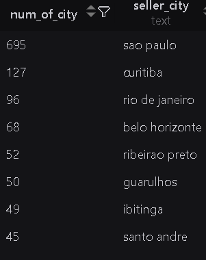
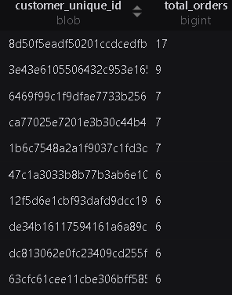
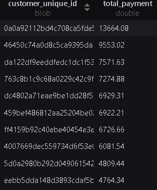
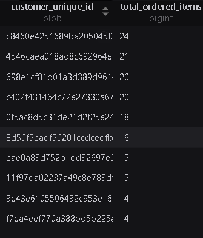
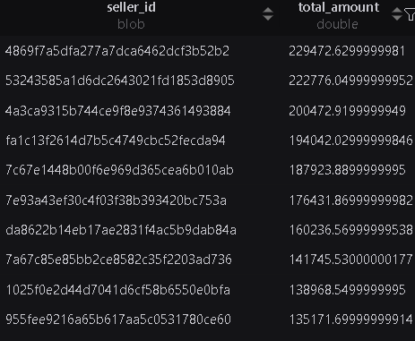
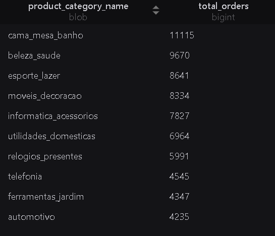
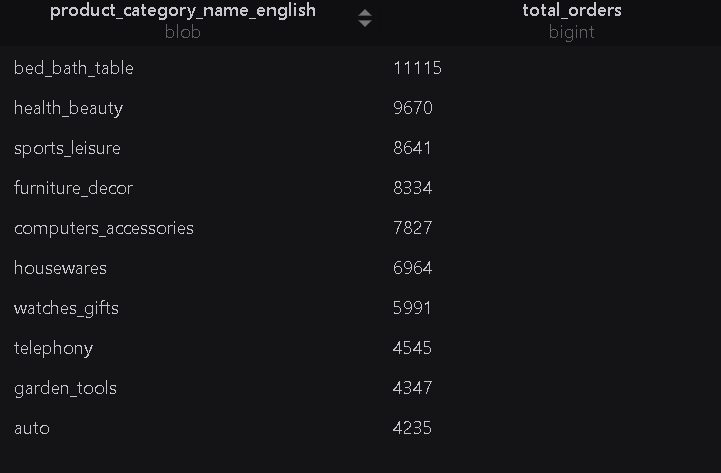

# Olist Brazil E-commerce Dataset Analysis

## Database Relationships

### 1. Customers ↔ Orders
**Relationship:** One-to-Many (1:N)

One customer can place multiple orders.

```
customers 1 ─────────< orders
```

---

### 2. Orders ↔ Order Items
**Relationship:** One-to-Many (1:N)

One order can contain multiple items.

```
orders 1 ─────────< order_items
```

---

### 3. Sellers ↔ Order Items
**Relationship:** One-to-Many (1:N)

One seller can sell many order items.

```
sellers 1 ─────────< order_items
```

---

### 4. Products ↔ Order Items
**Relationship:** One-to-Many (1:N)

One product can appear in multiple order items.

```
products 1 ─────────< order_items
```

---

### 5. Orders ↔ Order Payments
**Relationship:** One-to-Many (1:N)

One order can have one or more payment records.

```
orders 1 ─────────< order_payments
```

---

### 6. Orders ↔ Order Reviews
**Relationship:** One-to-Many (1:N)

Each order can have a review record.

```
orders 1 ─────────< order_reviews
```

---

# Individual Table Analysis

## Customers

### Customer Distribution by State

States with the highest number of customers:

- SP
- RJ
- MG
- RS
- PR
- SC
- BA
- DF


---

### Customer Distribution by City

Cities with the highest number of customers:

- São Paulo
- Rio de Janeiro
- Belo Horizonte
- Brasília
- Curitiba


---

## Products

- Total unique product categories: **74**

---

## Orders

- Total number of orders: **99,441**

### Order Status Distribution


---

## Geolocation

### Number of Postal Code Records by City


---

### Number of Postal Code Records by State


---

## Sellers

### Seller Distribution by City



---

# Multi-Table Analysis

## Top 10 Customers by Number of Orders



---

## Top 10 Customers by Total Payment



---

## Top 10 Customers by Number of Items Purchased



---

## Top 10 Sellers by Revenue

Revenue is calculated using the total value of products sold.



---

## Top 10 Best-Selling Product Categories

### Portuguese Category Names



### English Category Names

