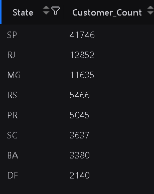
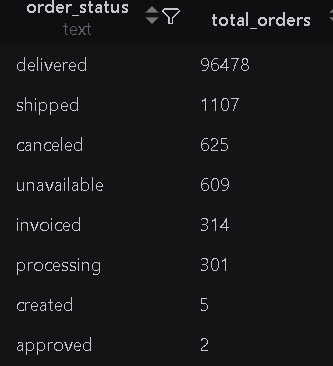
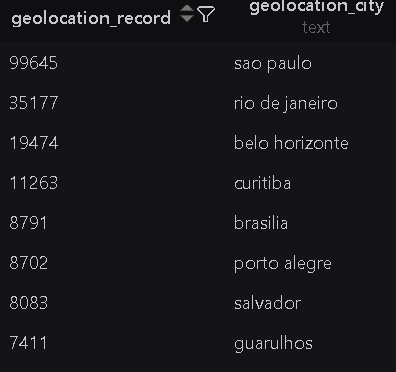
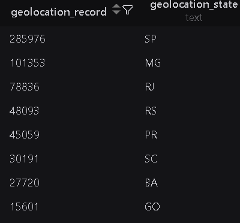

## Diagram Relation

- Customer & Order : 1 to many relation (1 customer can have many orders)
    -  customers 1 ───────< orders
- Orders & Order Item : 1 to many relation (1 customer can have many orders)
    - orders 1 ───────< order item
- Seller & Order Item: 1 to many relation (1 customer can have many orders)
    - sellers 1 ───────< order item
- Products & Order Item : 1 to many relation (1 customer can have many orders)
    - products 1 ───────< order item
- Order & Order Payment : 1 to many reation ( 1 order can have one or multiple payment records.)
    - orders 1 ───────< order_payments
- Order & Order Review : 1 to many reation ( 1 order can have many reviews)
    - orders 1 ───────< order_reviews

## Customers db analysis

- The state with most amount of customers;
    - SP, RJ, MG, RS, PR, SC, BA, DF

- The City with most amount of customers;
    - sao paulo, rio de janeiro, belo horizonte, brasilia, curtitiba

## Products Table

- Number of Unique product are 74.

## Orders Table

- No.of Orders are 99,441

- Unique Values of **order status**
    
    

## Geolocation

Number of Postal Record of City

Number of Postal Record of State
